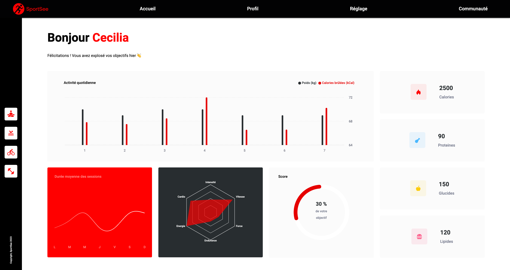

<a name="readme-top"></a>

# SportSee

![html][html5-badge]
![css][css3-badge]
![javascript][javascript-badge]
![react][react-badge]
![sass][sass-badge]
![vscode][vscode-badge]

## Description

Vous travaillez en tant que développeur chez SportSee, une startup dédiée au coaching sportif. En pleine croissance, l’entreprise va aujourd’hui lancer une nouvelle version de la page profil de l’utilisateur. Cette page va notamment permettre à l’utilisateur de suivre le nombre de sessions réalisées ainsi que le nombre de calories brûlées.



Votre objectif sera de créer cette page de profil en :
- utilisant une librairie pour les graphiques (D3 ou Recharts)
- suivant la [maquette Figma](https://www.figma.com/file/bAnXDNqRKCRRP8mY2gcb5p/UI-Design?node-id=4%3A1)
- complétant les user stories figurant dans les TODO du [Kanban](https://openclassrooms.notion.site/Tableau-de-bord-SportSee-6686aa4b5f44417881a4884c9af5669e?p=26fbb33e95e24ffeadeb24540c8b4686&pm=s)

## Compétences évaluées

- Assurer la qualité des données d'une application
- Développer des éléments graphiques avancés à l'aide de bibliothèques JavaScript
- Interagir avec un service Web

## Notes d'installation

### Frontend

Cloner le repository via :

```git clone https://github.com/vzamboulingame/openclassrooms-projet-12.git```

Lancer le frontend comme suit :

```
cd openclassrooms-projet-12
npm install
npm start
```

Le site sera alors accessible en local via l'URL :

```
http://localhost:4000
```

On pourra ensuite se loguer avec l'un des 2 UserID suivants : 12 (Karl) ou 18 (Cecilia).

### Backend

Cloner le repository via :

```git clone https://github.com/OpenClassrooms-Student-Center/P9-front-end-dashboard.git```

Lancer le backend comme suit :

```
cd P9-front-end-dashboard
yarn install
yarn dev
```

L'API du backend sera alors accessible en local via l'URL :

```
http://localhost:3000
```

La liste des endpoints possibles se trouve [ici](https://github.com/OpenClassrooms-Student-Center/P9-front-end-dashboard#41-possible-endpoints).

## Contact

Vinodh Zamboulingame

[![linkedin][linkedin-badge]][linkedin-url]
[![github][github-badge]][github-url]

<p align="right"><a href="#readme-top">back to top</a></p>

<!-- BADGE LINKS -->

[html5-badge]: https://img.shields.io/badge/HTML5-E34F26?style=for-the-badge&logo=html5&logoColor=white
[css3-badge]: https://img.shields.io/badge/CSS3-1572B6?style=for-the-badge&logo=css3&logoColor=white
[sass-badge]: https://img.shields.io/badge/Sass-CC6699?style=for-the-badge&logo=sass&logoColor=white
[javascript-badge]: https://img.shields.io/badge/JavaScript-F7DF1E?style=for-the-badge&logo=javascript&logoColor=black
[react-badge]: https://img.shields.io/badge/React-20232A?style=for-the-badge&logo=react&logoColor=61DAFB
[vscode-badge]: https://img.shields.io/badge/Made%20with-VSCode-1f425f.svg?style=for-the-badge&logoColor=white
[linkedin-badge]: https://img.shields.io/badge/LinkedIn-0077B5?style=for-the-badge&logo=linkedin&logoColor=white
[linkedin-url]: https://www.linkedin.com/in/vzamboulingame
[github-badge]: https://img.shields.io/badge/GitHub-0a0a0a?style=for-the-badge&logo=github&logoColor=white
[github-url]: https://github.com/vzamboulingame
